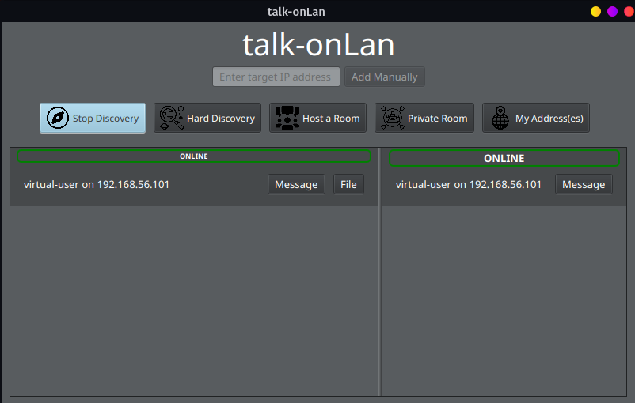
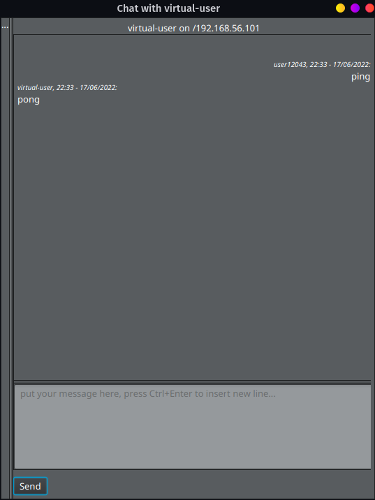
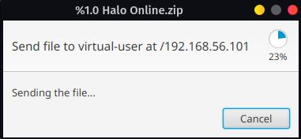

<h1 align="center">talk-onLan</h1>
Simple chatting and file transfer app works on the local network.

## Features

- Automatic discovery of others by publishing broadcast packages
- Manual discovery for ones undiscovered by automatic discovery
- Chat with others
- File sharing
- Rooms for group chats

> WARNING: This application is designed for use in small local network.
> but doesn't need to be used in. Be aware that there is no encryption
> during communication.

## Screenshots

### To-do list

- Remove users from list *(Need to discover again to display)*
- Blacklist specific users *(Will be ignored even re-discovered)*
- Scroll the message panel on new message
